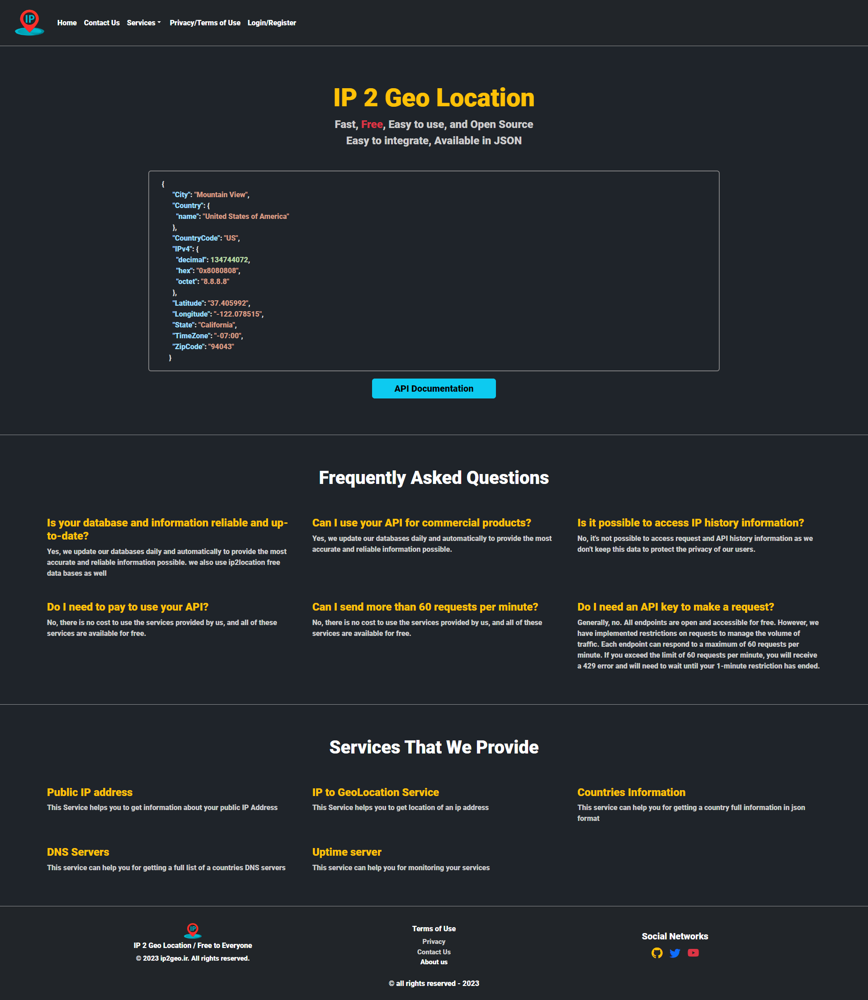
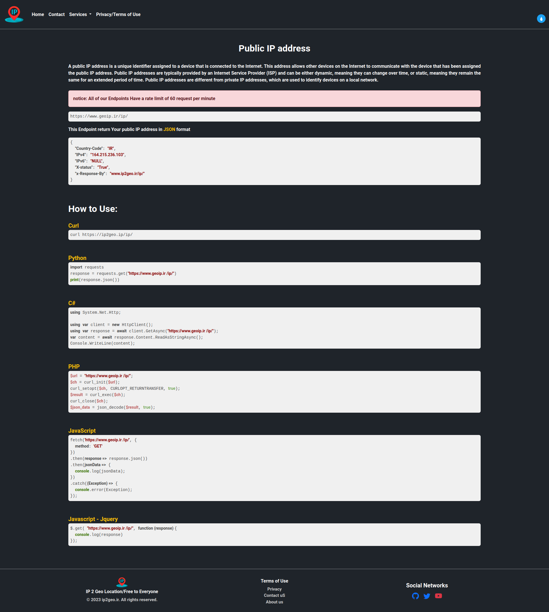
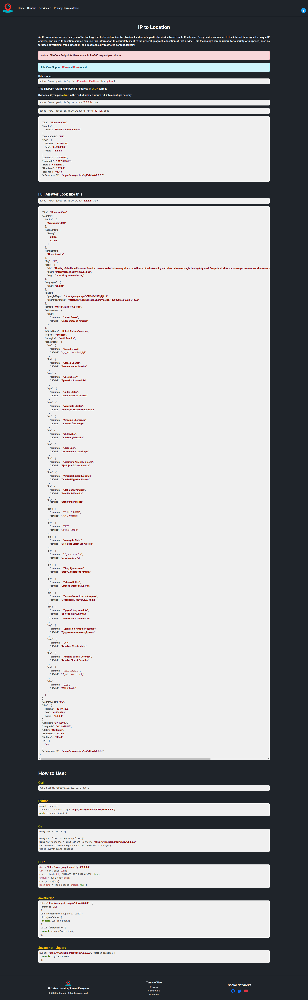

# GeoIP-API
### api service for converting IP addresses to Location 

### Tech stack:

        Python3
        Flask 2.3x
                Flask-wtf
                Flask-Sqlalchemy
                Flask-Migrate
                Flask-Caching
                Flask-Limiter
                Flask-Captcha2
                Flask-Cors
        Redis
        

## how to run :
 
### 0.0 create a virtual env   
    python -m venv venv

### 0.1 activate virtual env
    
    linux-mac :
            source ./venv/bin/active
    windows:
            ./venv/Scripts/activate

    
### 0.2 install dependency:
        
        pip install -r requirements.txt

### 0.3 change.env file

        mv .env.sample .env
        then change data in .env file (like database name, ...)

### Migrate to db

before running the below commands connect to you database and create a database (don't forget to put database name in .env file)        

    
    flask db migrate 
    flask db upgrade

### run App
    
        python app.py
        or
        flask run [--debug(for debug) --reload(reload template) --port 8080(for port)]
            [...] is optional

---

### at this point web app is up and running 
but there is no data in database so let add some data to database

## warning : before running any of below script you should first fill up .env file and also migrate changes to db !
### 0.0 for adding automatically data 
        
        cd ./GeoIpUpdater
        python fetchAndInsertdata.py 
                
        - this script automatically fetch a dataset from github
            and then update database with new data

### 0.1 just insert data
#### if you have data your self just run below script

        cd ./GeoIpUpdater
        python InsertDataByFile.py

        - this script insert data to database base on an input file ( file is required )

## Deploy to Server:

### This Web App configure for Deploy to <a href='https://liara.ir'>liara.ir</a> - if you want to deploy to other Pass Service providers make sure to change configuration base of service provider that you use.

#### For See How Deploy To liara.ir see <a href='./doc/Deploy/liara.ir'>Here</a>

